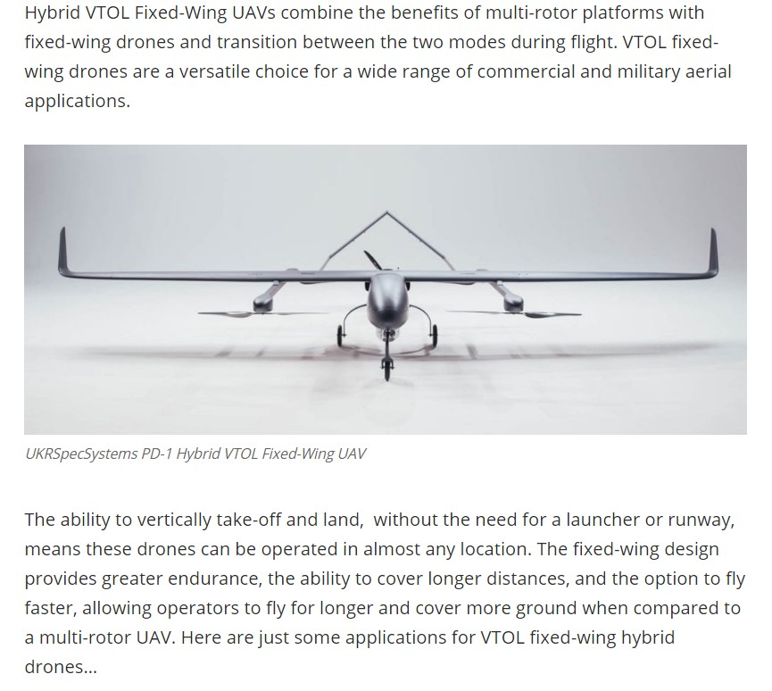
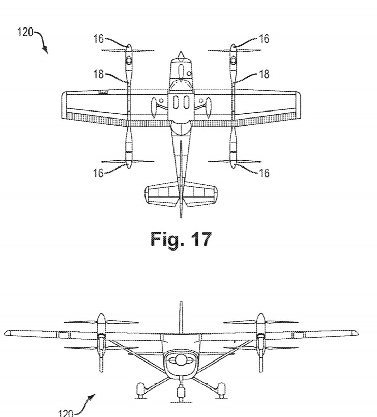

##  *Les avions à décollage et atterissage vertical*

ANONYME. "Hybrid VTOL Fixed Wing UAV Manufacturers" [en ligne]. In : *Unmanned Systems Technology*. Mise à jour le 2 septembre 2019 [Consulté le 27 mai 2020]. Disponible sur le Web : <https://www.unmannedsystemstechnology.com/category/supplier-directory/platforms/hybrid-vtol-uav-manufacturers/>

BAITY, Sean Marshall, BILLINGSLEY, David D., GALLOWAY,  Brad S., CHAPMAN, Richard M. "Vtol aircraft having fixed-wing and rotorcraft configurations" [en ligne]. In : *Google Patents*. Publié le 9 mai 2019. [Consulté le 27 mai 2020]. 27 p. Disponible sur le Web : <https://patents.google.com/patent/US20190135424A1/en?q=*fixed+wing+hybrid+vtol*&oq=*fixed+wing+hybrid+vtol*&page=6>

*Retour à : [Les différents types de drones](cm.md)* 
[*retour à la page d'accueil*](index.md)
