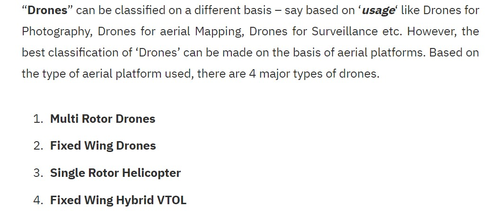

## Différents types de drones  

Ici nous étudierons les différents type drone séprarés en plusieurs catégories.  

JOJO. "Types of Drones - Explore the Different Types of UAV’s" [en ligne]. In *Circuits Today*. Mise à jour le 20 novembre [Consulté le 24 mai 2020]. Disponible sur le Web : <http://www.circuitstoday.com/types-of-drones>  

  

### [*Les drones mutirotors*](multir.md)  

### [*Les drones à voilure fixe*](voilfix.md)  

### [*les hélicoptères monorotors*](hmr.md)  

### [*Les avions à décollage et atterissage vertical*](avdecver.md)  

[*retour à la page d'accueil*](index.md)  
