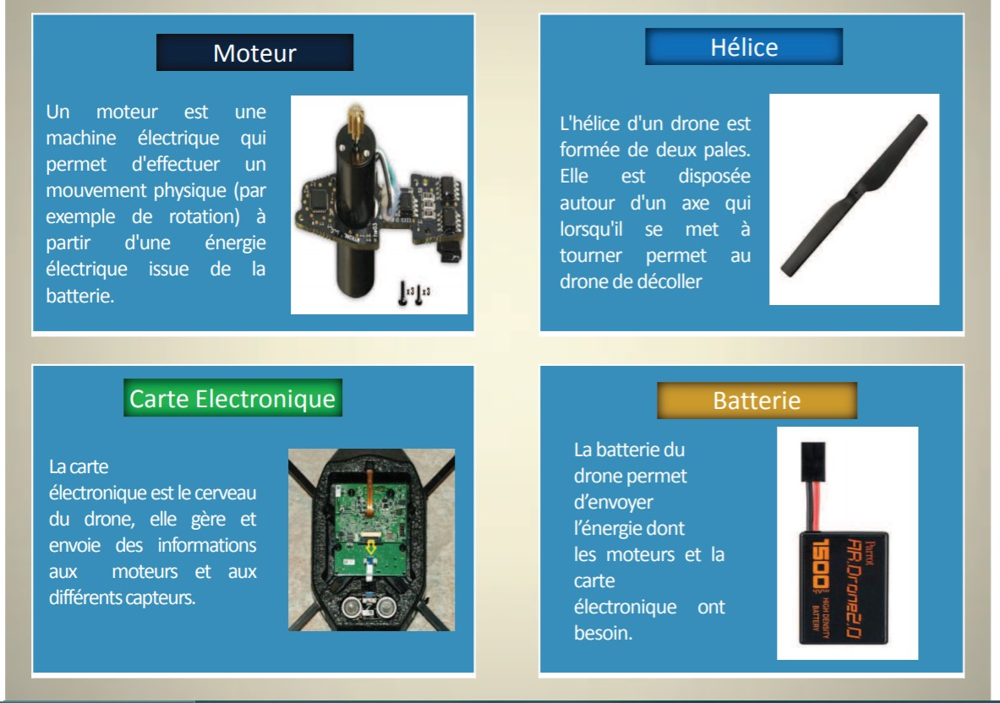

# Fonctionnement

De quoi est composé un drone et comment ses composants le font fonctionner, c'est ici que nous en parlons !

VELLUTINI, A, GIRVES, P, PIERI, A, ROSSI, L, TISON, Y et TOULOUSE, T. "Mode de pilotage d’un drone avec ROS"[en ligne]. In : *Portail Universita Corsica*. [consulté le 29 mai 2020]. 6 p. Disponnible sur le Web : <https://portailweb.universita.corsica/stockage_public/portail/baaaaart/files/Support_drone.pdf>

