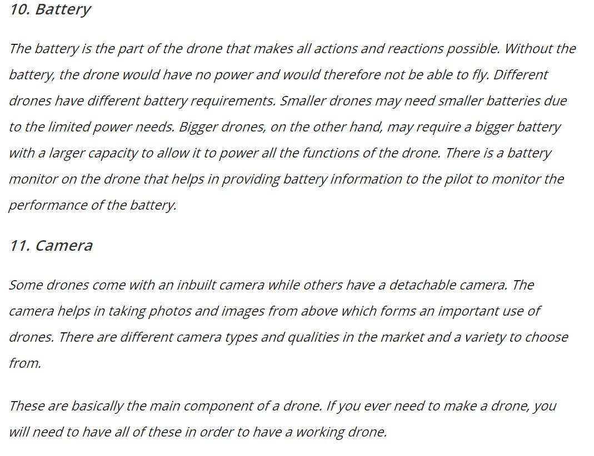

# Composants et Fonctionnement

De quoi est composé un drone et à quoi servent ces composants dans son  fonctionnement, c'est ici que nous en parlons !

VELLUTINI, A, GIRVES, P, PIERI, A, ROSSI, L, TISON, Y et TOULOUSE, T. "Mode de pilotage d’un drone avec ROS" [en ligne]. In *Portail Universita Corsica*. [consulté le 29 mai 2020]. 6 p. Disponnible sur le Web : <https://portailweb.universita.corsica/stockage_public/portail/baaaaart/files/Support_drone.pdf>

SMITH, Michael. "Drone Anatomy 101" [en ligne]. In *BH Photo video*. Publié en 2018 [consulté le 01 mai 2020]. 7 p. Disponible sur le Web : <https://static.bhphotovideo.com/FrameWork/Product_Resources/monthlyPDF/winter2018/aerial.pdf>  

  

"What Drones Are Made Of? Materials Selection For Drones" [en ligne]. In *Materials Blog - Matmatch* . Mise à jour le 23 octobre 2019 [Consulté le 31 mai 2020]. Disponible sur le Web :<https://matmatch.com/blog/what-are-drones-made-of/>  

  

ADMIN. "Drone Components Quick List of it’s Parts". In *Grind Drone* [en ligne]. Mise à jour le 1 avril 2020 [Consulté le 31 mai 2020]. Disponible sur le Web : <http://grinddrone.com/drone-features/drone-components>  

  

SHERRY, Lance. "Components of a Quadcopter"[en ligne]. In *Center for air transportation systems research*. Publié en 2019 [consulté le 31 mai 2020]. 26 p. Disponible sur le Web : <https://catsr.vse.gmu.edu/SYST460/DroneComponents.pdf>  

  

  

  

ANONYME. "UAV & Drone Propellers Drone Propeller Manufacturers & Suppliers"[en ligne]. In *Unmanned Systems Technology* . Mise à jour le 7 septembre [Consulté le 31 mai 2020]. Disponible sur le Web : <https://www.unmannedsystemstechnology.com/category/supplier-directory/propulsion-power/propellers/>

  

NB : Je n'ai mis en évidence qu'un, deux ou trois composants par sources mais toutes les sources, de cette page sont utiles pour tous les composants cités sauf la dernière qui porte exclusivement sur les hélices.  

[*retour à la page d'accueil*](index.md)

