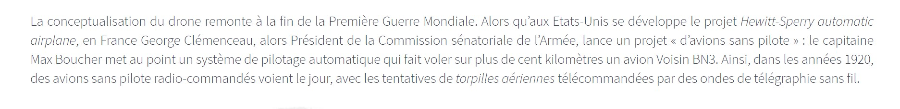
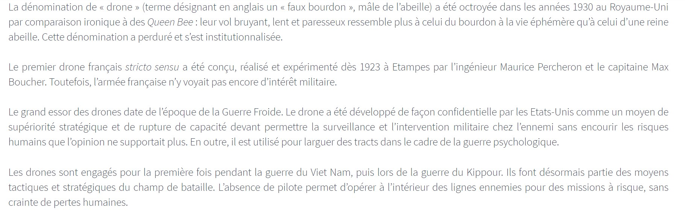
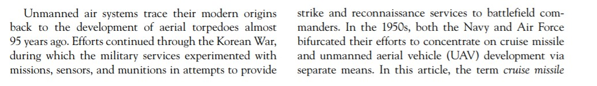
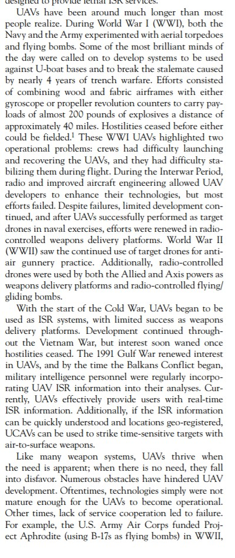
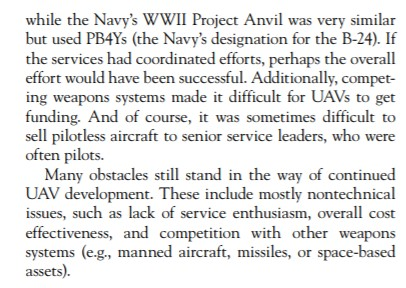

## De la création des drones à nos jours

Rien n'est figé dans le temps et tout évolue, voici un apperçut de l'évolution du drone :

ANONYME."Histoire du drone"[en ligne]. In * Fédération Professionnelle du Drone Civil*. Mise à jour le 24 avril 2019 [Consulté le 18 mai 2020]. Disponible sur le Web : <https://www.federation-drone.org/les-drones-dans-le-secteur-civil/histoire-du-drone>

KEANE, John F et CARR, Stephen S. "A Brief History of Early Unmanned Aircraft" [en ligne]. *Johns Hopkins APL Technical Digest*. 2013 [consulté le 24 mai 2020], Vol. 32, nᵒ 3, p. 14. Disponnible sur le Web : <citeseerx.ist.psu.edu/viewdoc/download?doi=10.1.1.686.7958&rep=rep1&type=pdf>

[*retour à la page d'accueil*](index.md)
