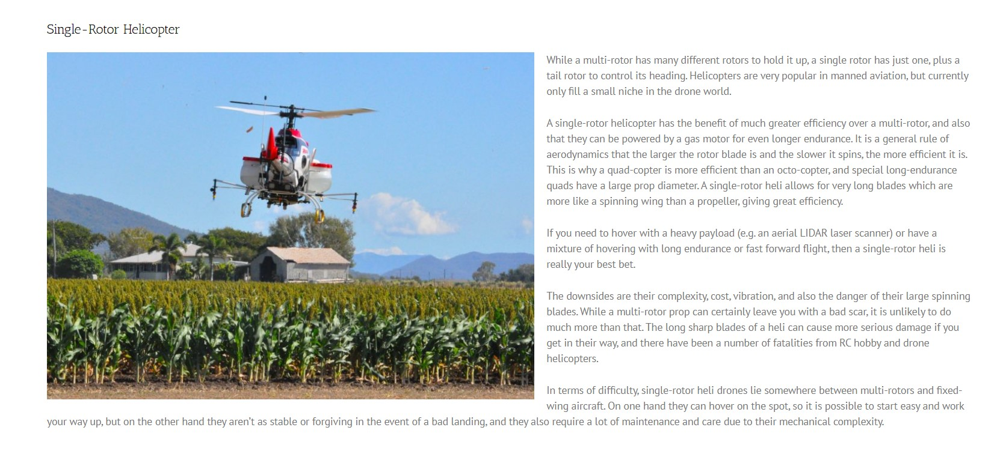
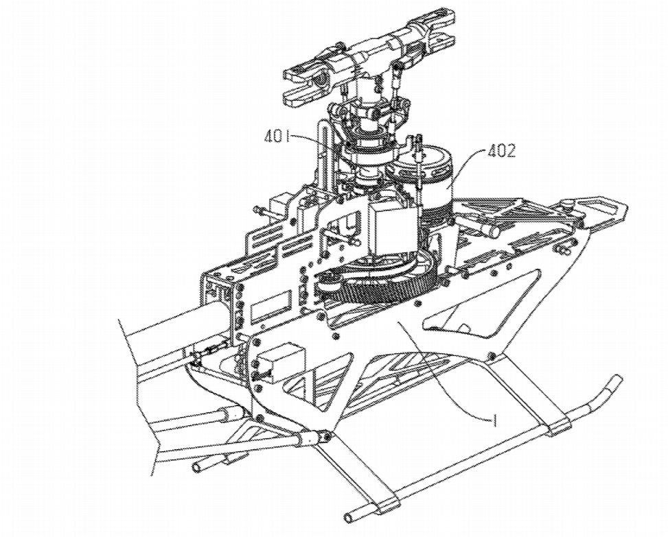

##  *les hélicoptères mono rotor*

CHAPMAN, Andrew. "Types of Drones: Multi-Rotor vs Fixed-Wing vs Single Rotor vs Hybrid VTOL" [en ligne]. In *AUAV*. Mise à jour le 5 avril 2020 [Consulté le 27 mai 2020]. Disponible sur le Web : <https://www.auav.com.au/articles/drone-types/>

罗佳文. "单旋翼无人机的驱动系统" [en ligne]. In *Google Patents*. Publié le 13 février 2020 [Consulté le 27 mai 2020]. 20 p. Disponible sur le Web : <https://patentimages.storage.googleapis.com/c4/5b/04/0eac5088c1a796/WO2020029102A1.pdf> 

*Retour à : [Les différents types de drones](cm.md)*  
[*retour à la page d'accueil*](index.md)
