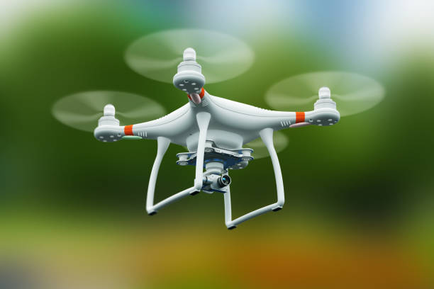

## ***Accueil***

[center][/center]

Dans le cadre des cours d'outils bureautiques et d'architecture des ordinateurs et des réseaux informatiques (AORI) de ma première année de cours à l'IESSID, j'ai été conviée à faire un dossier documentaire sous forme de site sur la technologie de mon choix. Voici donc mon site sur les drones.

Dans ce dossier j'aborderais différents domaines relatifs aux drones :

1.[L'historique de la création des drones à nos jours](historique.md)  

2.[Les différents types de drones](cm.md)  

* [Les drones multirotors](multir.md)   
 * [Les drones à voilure fixe](voilfix.md)  
 * [les hélicoptères monorotors](hmr.md)  
 * [Les avions à décollage et atterissage vertical](avdecver.md)  
 

3.[Le fonctionnement pratique d'un drone](fonct.md)  

4.[Les différentes utilisations possibles pour un drone](uti.md)   

* [Utilisation militaire](um.md)
* [Utilisation civile](uc.md)

5.[Les différentes réglementations selon les pays](regle.md)

Mais avant tout ça, voici une petite introduction sur : [Qu'est-ce qu'un drone](intro.md) ?
