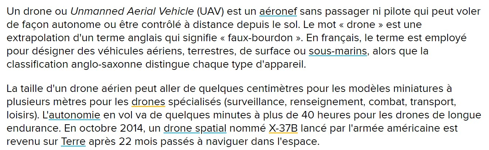

##  Introduction

### Quelques informations générales à propos des drones :

LAROUSSE," Éditions. Définitions : drone" [en ligne]. In *Dictionnaire de français Larousse*. Mise à jour le 7 septembre 2019 [Consulté le 13 mai 2020]. Disponible sur le Web : <https://www.larousse.fr/dictionnaires/francais/drone/26865>

 

CAMBRIDGE DICTIONARY, "Meaning of drone in English" [en ligne]. In *Cambridge English Dictionary*. Mise à jour le 27 septembre 2019 [Consulté le 13 mai 2020]. Disponible sur le Web : <https://dictionary.cambridge.org/dictionary/english/drone>

LA REDACTION DE FUTURA, "Drone" [en ligne]. In *Futura*. Mise à jour le 16 avril 2020 [Consulté le 13 mai 2020]. Disponible sur le Web : <https://www.futura-sciences.com/sciences/definitions/aeronautique-drone-6174/>

Cette courte vidéo en anglais donne une explication rapide, mais complète sur ce qu'est un drone et ses utilisations possibles : [What is a Drone ?](https://www.youtube.com/watch?v=Cvvjda9y9Gk&feature=emb_logo)  

[*retour à la page d'accueil*](index.md)
