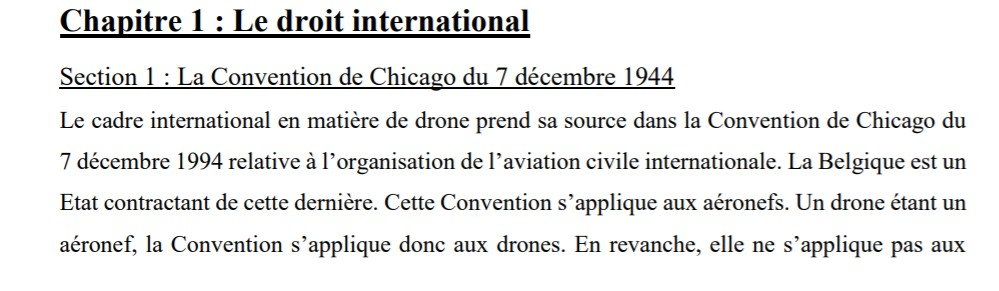
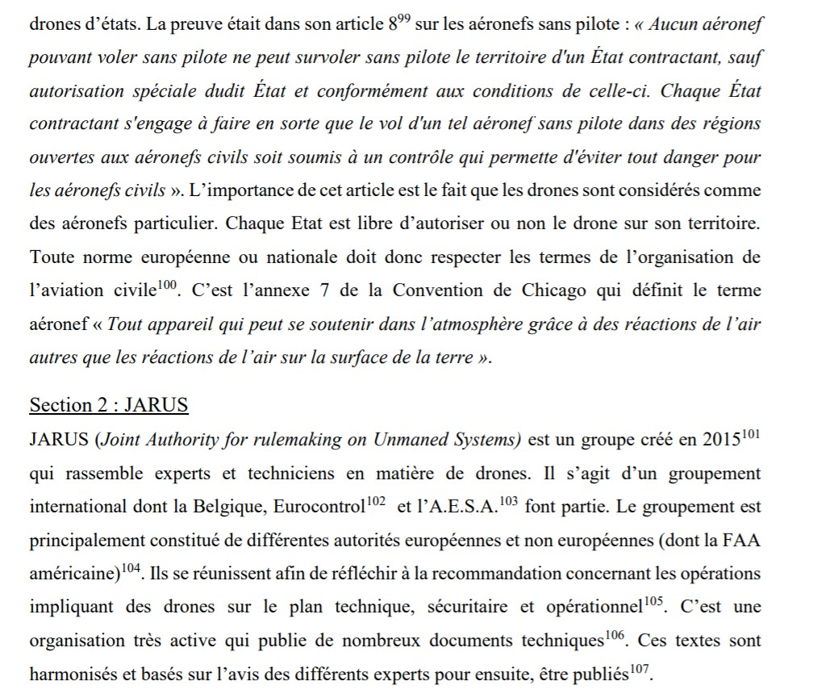

# Les différentes réglementations selon les pays :  

J'aborderais ici trois niveaux de réglementations : le belge, l'européen et l'international.  

MINISTERE DE LA SECURITE ET DE L'INTERIEUR. *Circulaire ministerielle réglant l'usage de drônes par les services de police et de secours*[en ligne]. 2019013525 : 8 juillet 2019. Disponible sur le Web : <http://www.ejustice.just.fgov.be/cgi_loi/change_lg.pl?language=fr&la=F&nm=2019013525>  
Ci-dessus la dernière loi belge concernant les drones, la précedante loi [2016014116](https://www.ejustice.just.fgov.be/cgi_loi/change_lg.pl?language=fr&la=F&cn=2016041002&table_name=loi) étant plus globale et plus complète, je la conseille fortement.  

Pour des informations plus aborables, le site de la [SPF Mobilité](https://mobilit.belgium.be/fr/transport_aerien/drones) donne des informations intéressantes et compréhensibles.

THE EUROPEAN COMISSION. *COMMISSION DELEGATED REGULATION (EU) 2019/945
of 12 March 2019 on unmanned aircraft systems and on third-country operators of unmanned aircraft systems*[en ligne]. 2019/945  :  12 mars 2019. Official Journal of the European Union, 2019. 40 p. Disponible sur le Web : <https://www.consilium.europa.eu/media/40525/delegated-act_drones.pdf>  
Ci dessus la dernière loi européenne sur les drones mais il est possible d'en trouver d'autres moins récentes [ici](https://www.consilium.europa.eu/fr/policies/drones/).  

BRACAVAL, Mathias. *L'assurance et la couverture du risque en matière de drone*.  Faculté de droit
et de criminologie : Université catholique de Louvain : 2019. Disponible sur le Web : <http://hdl.handle.net/2078.1/thesis:20196>  
NB: Ce document parle en détail des réglementations sur les trois niveaux mentionnés avant.  

  
  

Un site reroupe une liste de toutes les normes concernant les drones par états américains ainsi que pour tout les pays du monde : [Masterlist](https://uavcoach.com/drone-laws/).  

[*retour à la page d'accueil*](index.md)
