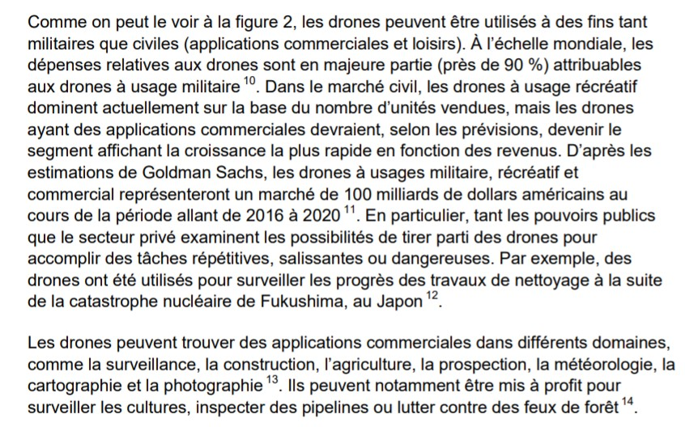
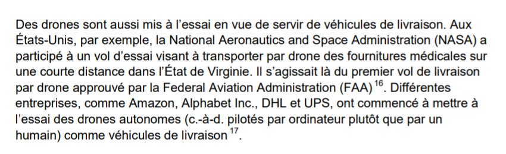
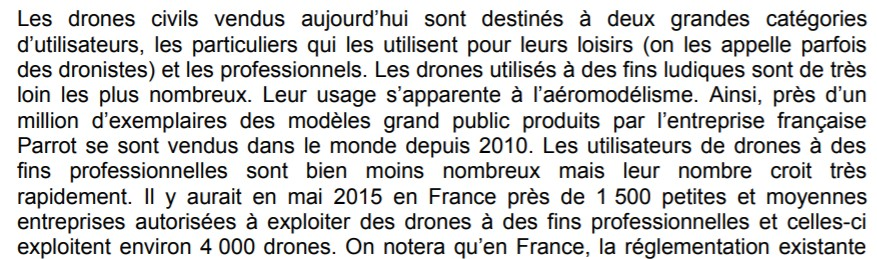
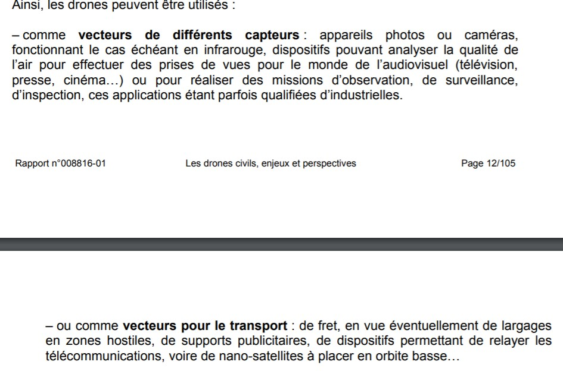
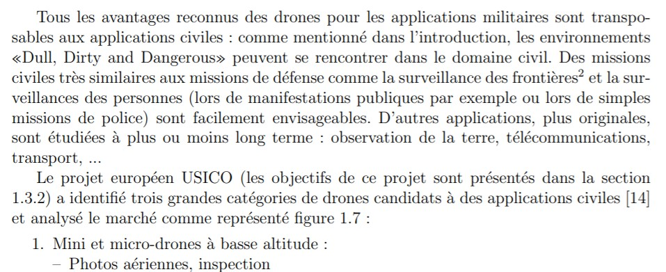
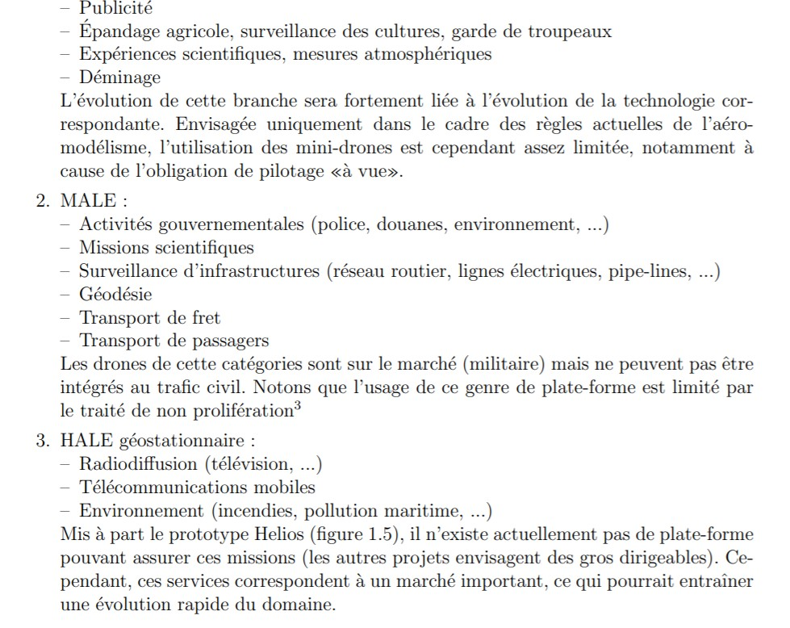

## Les utilisations civiles des drones :  

Nous regrouperons ici, différent types d'utilisations dans le domaine civil pour les drones :  

CHONG, Jed, SWEENEY, Nicole. "L'utilisation civile des drones au Canada"[en ligne] In *Parlement du Canada*. Publié le 16 octobre 2017 [consulté le 2 juin 2020]. 24 p. Disponible sur le Web : <https://bdp.parl.ca/staticfiles/PublicWebsite/Home/ResearchPublications/BackgroundPapers/PDF/2017-23-f.pdf>    

    
  

DAVID, Dominique, PANHALEUX, Jean. "Les drones civils, enjeux et perspectives"[en ligne]. In *Réplublique française : Vie publique*. Publié en octobre 2015 [consulté le 2 juin 2020]. 107 p. Disponible sur le Web : <https://www.vie-publique.fr/sites/default/files/rapport/pdf/164000015.pdf>  

NB : cet article étant très complet, il traite de beaucoup d'autres facettes des drones.  

  
  

BRISSET, Pascal. "Drones civils perspectives et réalités"[en ligne]. In : *Ecole nationale de l'aviation civile*.  Publié en août 2004 [consulté le 2 juin 2020]. 50 p. Disponible sur le Web : <http://recherche.enac.fr/~brisset/enac/brisset_sapin.pdf>

  
  

*Retour à : [Différentes utilisations](uti.md)*   
[*retour à la page d'accueil*](index.md)
