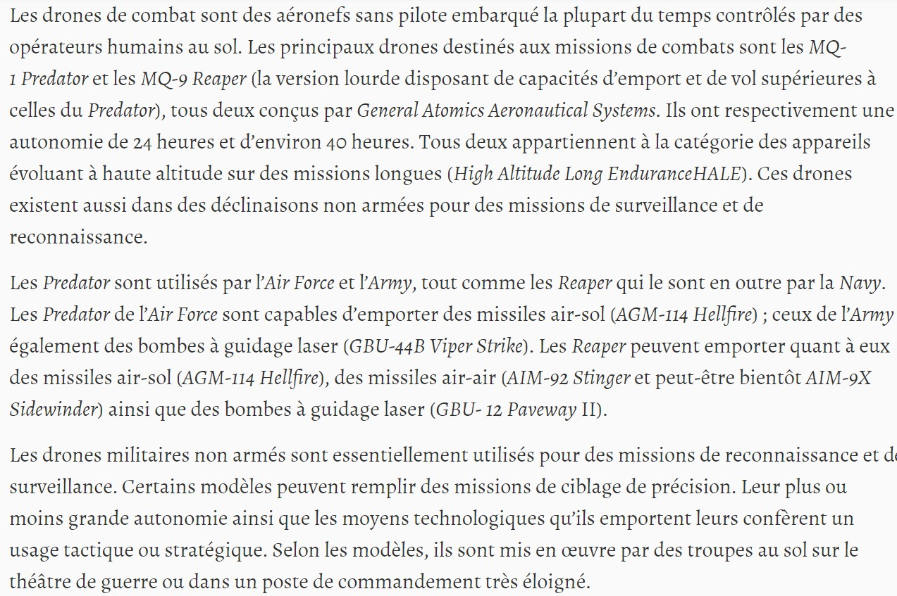
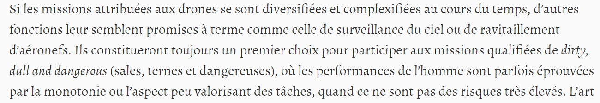
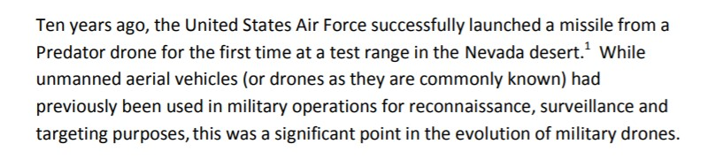

## Les utilisations militaires des drones :  

Nous regrouperons ici, différent types d'utilisations dans le domaine militaire pour les drones :    

BACONNET, Alexis. "Au pays des drones"[en ligne]. In *Outre-Terre*. Janvier 2014 [consulté le 2 juin 2020], vol. n° 38, nᵒ 1, p. 245‑248. Disponible sur le Web : <https://www.cairn.info/revue-outre-terre2-2014-1-page-245.htm>  

  

NOËL, Jean-Christophe. "Occuper sans envahir : drones aériens et stratégie"[en ligne]. In *Politique etrangere*. Octobre 2013 [consulté le 2 juin 2020], vol. automne, nᵒ 3, p. 105‑117. Disponible sur le Web : <https://www.cairn.info/revue-politique-etrangere-2013-3-page-105.htm>  

NB : cet article est aussi très pertinent en ce qui concerne l'histoire des drones militaires.  

   

COLE, Chris. "Drones wars briefing"[en ligne]. In *Cairn*. Publié en janvier 2012 [consulté le 2 juin 2020]. 36 p. Disponnible sur le Web : <https://dronewars.net/wp-content/uploads/2012/01/drone-wars-briefing-jan2012.pdf>  

   

*Retour à : [Différentes utilisations](uti.md)*  
[*Retour à la page d'accueil*](index.md)
