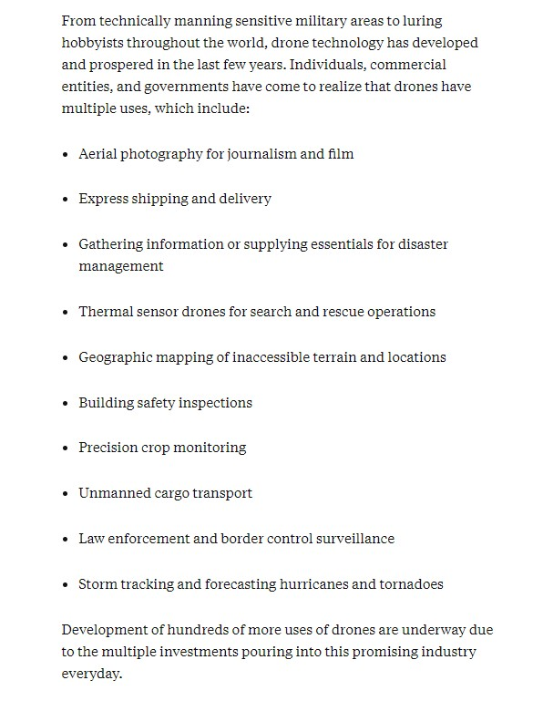

# **Différentes utilisations**

Maintenant que nous savons comment ils fonctionnent, penchons-nous sur : à quoi peuvent servir les drones ?

JOSHI, Divya. "Drone technology uses and applications for commercial, industrial and military drones in 2020 and the future" [en ligne]. In *Business Insider*. Publié le 19 septembre 2019 [Consulté le 2 juin 2020]. Disponible sur le Web : <https://www.businessinsider.com/drone-technology-uses-applications>

Il y a donc de nombreuses possibilités d'utilisations de drones, je vais les séparer en plusieurs catégories :

### [Les utilisations militaires](um.md)  

### [Les utilisations civiles](uc.md)

[*retour à la page d'accueil*](index.md)
