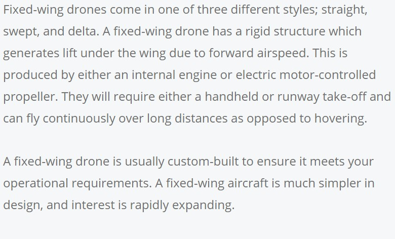
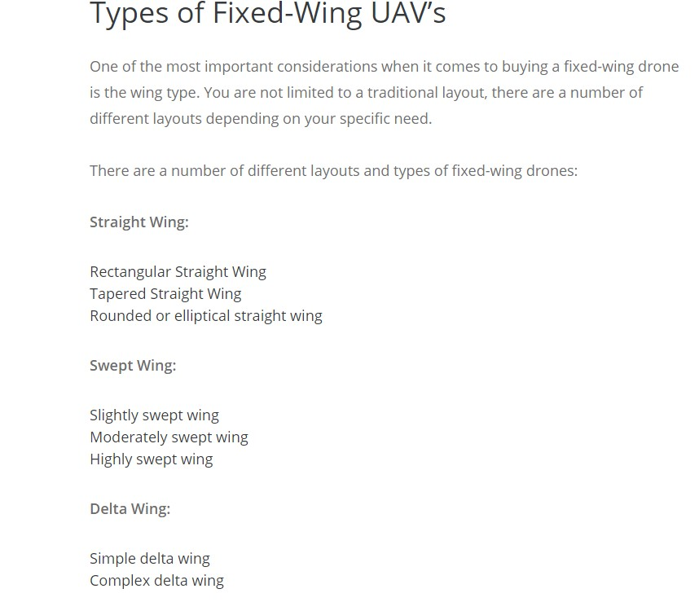
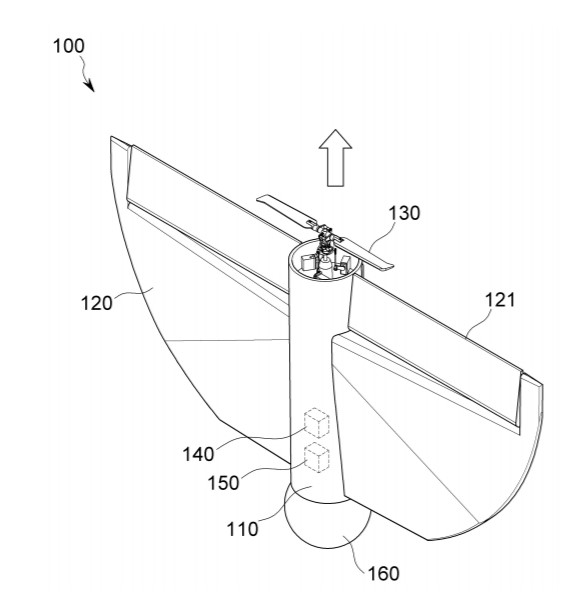
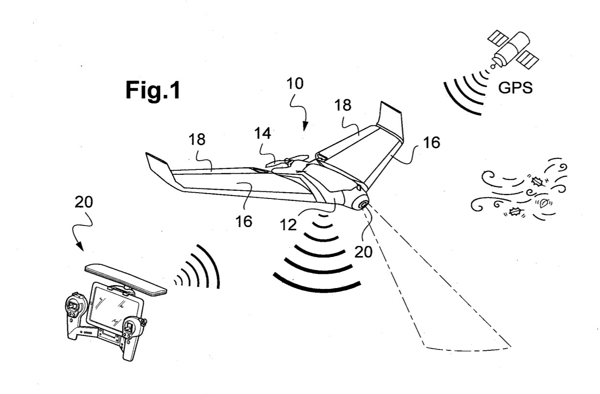
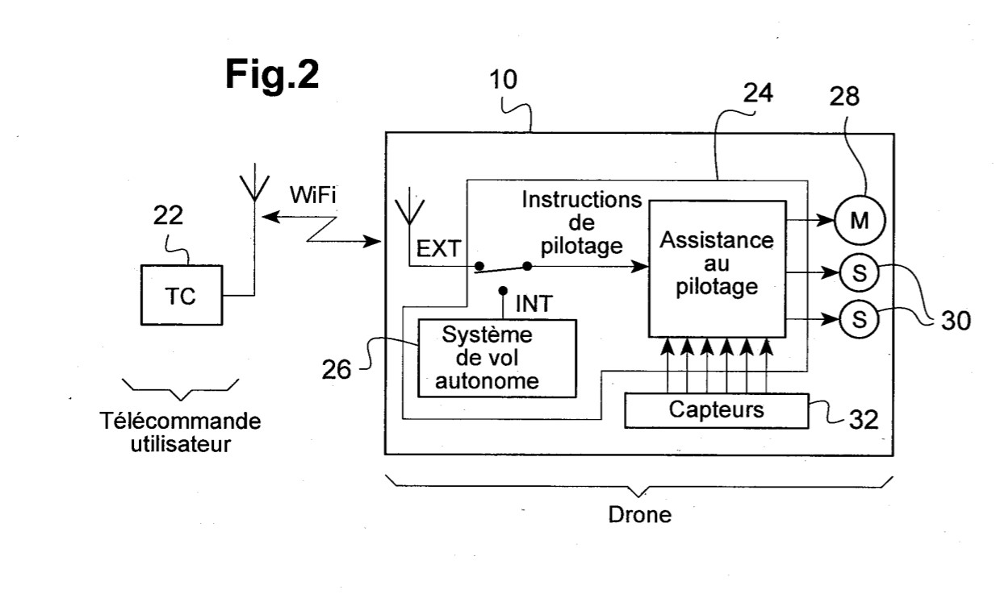

##  *Les drones à voilure fixe*

ANONYME. "A Guide to Fixed Wing Drones" [en ligne]. In : *COPTRZ*. [Consulté le 27 mai 2020]. Disponible sur le Web : <https://www.coptrz.com/a-guide-to-fixed-wing-drones/>

유창범. "가변 피치 프로펠러를 이용한 고정익 드론" [en ligne]. In : *Google Patents*. Mise à jour le 26 octobre 2018. [Consulté le 26 mai 2020]. Disponible à l’adresse sur le Web : <https://patents.google.com/patent/KR20180116849A/en?q=fixed+wing+drones&oq=fixed+wing+drones>

RIMOUX, Ariel et PIRAT, Frederic. "Drone a voilure fixe, notamment de type aile volante, avec pilotage manuel assiste et pilotage automatique" [en ligne]. In : *Google Patens*. Mise à jour le 9 février 2018. [Consulté le 26 mai 2020]. Disponible à l’adresse : <https://patents.google.com/patent/FR3054824A1/en?q=fixed+wing+drones&oq=fixed+wing+drones>

*Retour à : [Les différents types de drones](cm.md)*  
[*retour à la page d'accueil*](index.md)
